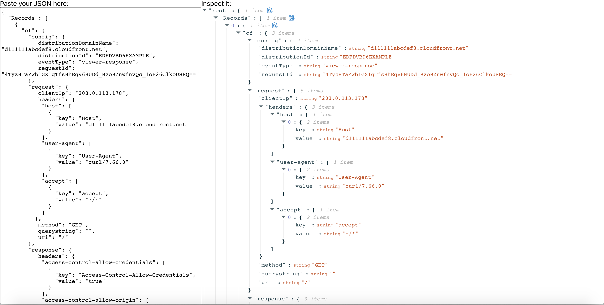

# Inspect JSON in your Browser

## Description

A tool I quickly put together using [react-json-view from mac-s-g](https://github.com/mac-s-g/react-json-view). I use this rather than any other toool, since I dont trust the available online tools.

You can try it here: [json.flonatello.dev](https://json.flonatello.dev)

## Screenshot

